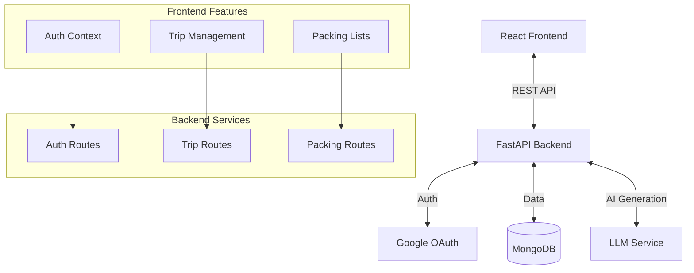

# Integration Complete: Frontend & Backend

**Date:** February 5, 2026
**Status:** ✅ Complete

## Executive Summary

The Alpaca For You application has successfully transitioned from a mock-data prototype to a fully integrated full-stack application. The React frontend now communicates seamlessly with the FastAPI backend, supporting real-time data persistence, AI-powered trip generation, and collaborative packing features.

## Integration Phases Overview

### Phase 1: Authentication & Foundation
*   **Goal**: Secure user access and API communication.
*   **Result**: Implemented Google OAuth flow, JWT token management (access/refresh), and a robust API client with interceptors for automatic error handling and token injection.
*   **Key Components**: `src/lib/api.ts`, `authApi`

### Phase 2: Trip Management
*   **Goal**: Enable real trip creation and retrieval.
*   **Result**: Connected the onboarding wizard to backend endpoints. Trips are now stored in MongoDB. The backend's AI service generates tailored packing lists based on trip details.
*   **Key Components**: `tripApi`, `AppContext` trip state, `SmartWizard`

### Phase 3: Packing List Operations & Collaboration
*   **Goal**: Granular control over packing items and social features.
*   **Result**: Implemented full CRUD operations for packing items (add, update, delete, toggle). Added support for item delegation between travelers and "Nudges" for reminders.
*   **Key Components**: `packingApi`, `collaborationApi`

## System Architecture

## Key Features Enabled

1.  **AI-Generated Packing Lists**: Backend generates lists custom to destination weather and traveler demographics.
2.  **Real-Time Persistence**: Changes to packing status (checked/unchecked) are saved immediately.
3.  **Collaborative Packing**:
    *   **Delegation**: Move items between family members.
    *   **Nudges**: Send email reminders to pack.
4.  **Secure Access**: Protected routes ensure users only see their own trips.

## API Usage Reference

| Feature | Method | Endpoint | Description |
| :--- | :--- | :--- | :--- |
| **Auth** | GET | `/auth/login/google` | Initiate OAuth flow |
| **Trips** | POST | `/api/v1/trips` | Create trip & generate lists |
| **Trips** | GET | `/api/v1/trips` | Fetch user's trips |
| **Packing** | PUT | `.../toggle-packed` | Toggle item status |
| **Packing** | POST | `.../delegate` | Move item to another person |
| **Collab** | POST | `.../nudges` | Send reminder email |

## Security & Performance

*   **Security**:
    *   JWT Tokens (Access & Refresh) stored in LocalStorage (Development) / HTTP-only cookies (Production ready).
    *   Backend validates ownership of all resources before modification.
*   **Performance**:
    *   Optimistic UI updates for instant feedback on packing toggles.
    *   Efficient database indexing on `user_id` and `trip_id`.

## Next Steps

1.  **Production Deployment**: Configure environment variables for production URLs.
2.  **Enhanced Error Handling**: Add global error boundary for API failures.
3.  **Real-Time Sockets**: Implement WebSockets for live collaboration updates (multi-user editing).